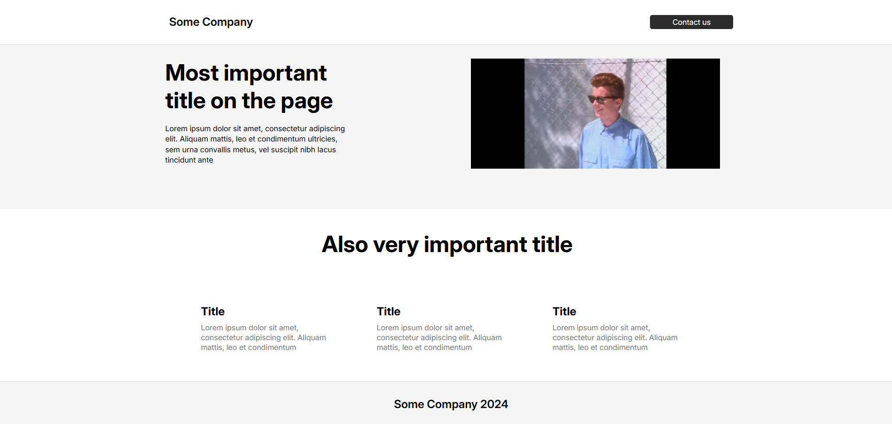
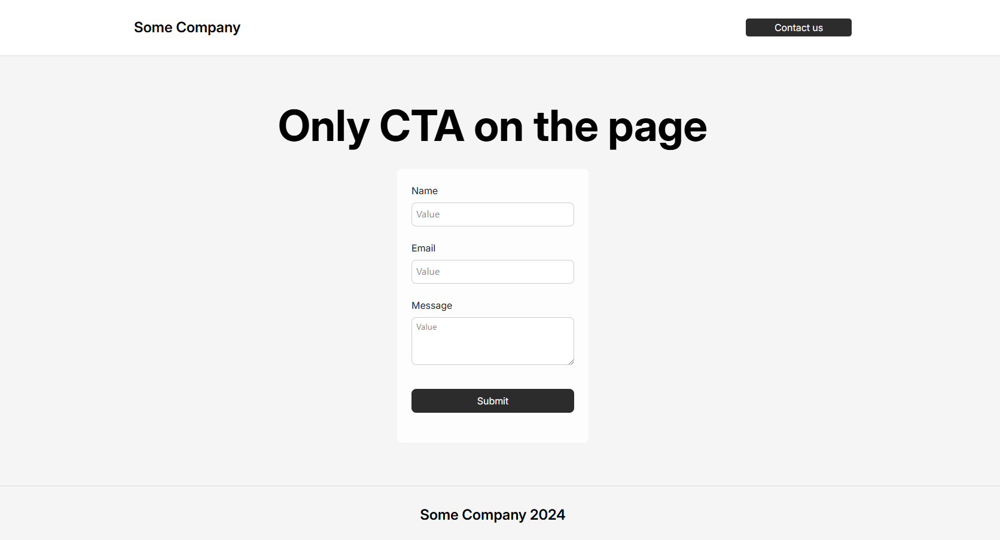

# Cadex test task

## Project Description

This responsive web application facilitates seamless communication between users and a company or service. It serves as a contact platform for feedback.

After form submission on the server admin of the project can see message in the format:

```js
Form submitted: { name: 'name', email: 'email', text: 'text' }
```

Backend responses in format:

```js
{
  message: "Thank you for your interest, name!";
}
```

Deployed application is here: [cadex.ilyadev.tech](https://cadex.ilyadev.tech/).

For the form I use POST-request `api/submitForm`, while developing you can reach it via `http://127.0.0.1:3000/api/submitForm`. You can use Postman for this simple API testing.


How the [main page](https://cadex.ilyadev.tech/) looks.

### Features

- **Responsive Design**: Functions well on all devices, from mobile to desktop.
- **Contact Form**: Allows users to submit inquiries with input validation and feedback.
- **Styled Components**: Utilizes styled-components for modular, dynamic styling.
- **SEO Optimization**: Implements robots.txt, relevant meta-tags, and semantic HTML for improved search engine visibility.
- **Performance Enhancements**: Employs code splitting and lazy loading for quick load times.
- **Fixed Header and Footer**: Ensures easy navigation with persistent headers and footers.


How the [form](https://cadex.ilyadev.tech/contact) looks.

## Table of Contents

- [Project Setup](#project-setup)
- [Hosting Details](#hosting-details)
- [Styling](#styling)
- [SEO Strategies](#seo-strategies)

## Project Setup

To set up this project locally, follow these instructions:

1. **Clone the repository**:

```bash
git clone https://github.com/nibezo/cadex_test_task.git
```

2. Navigate to the project directory:

```bash
  cd cadex_test_task
```

3. Install dependencies:

```bash
  npm install
```

4. Run the development server:

```bash
  npm run dev
```

Now cadex_test_task is running on `http://localhost:3000`.

## Hosting Details

I deploy it on my own VPS. I dockerized the app and used [Dokploy](https://dokploy.com/) for control the deployment process.

## Styling

Styled Components: The project uses Styled Components library (with mixins) for styling and Radix UI and also has responsive mobile design.

## SEO Strategies

Semantic HTML: Used semantic tags (e.g., `<header>, <footer>, <nav>, <article>`) to improve search engine indexing.

Meta Tags: Relevant meta tags are included in the `<head>` of the document for better search visibility.

`robots.txt` and `sitemap.xml`: Included to guide search engine crawlers on indexing the site effectively.
